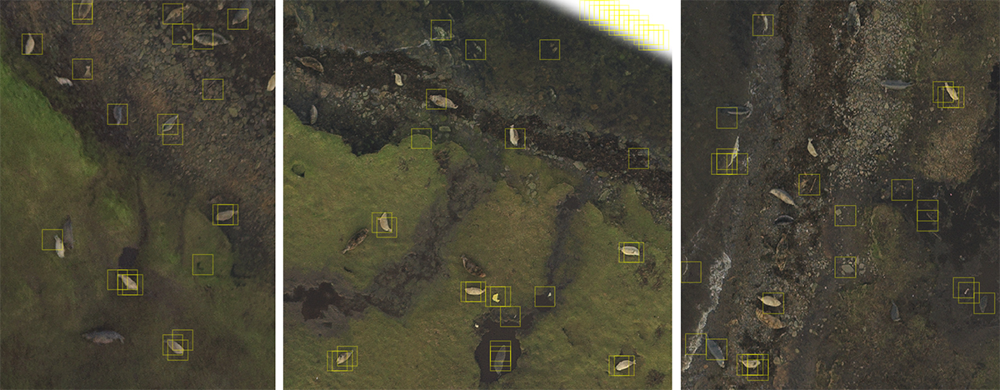

# Save Wally
### Throwing machine learning at the identification of seals from aerial photographs.
Geoscience Hackathon in Aberdeen (16-18/11/2018)
#
We used a dataset of around 3000 geolocated seals from a Scottish island to train 
a Linear Support Vector classifier (sklearn.svm.LinearSVC). The quickly trained classifier
can then be used to convolve across a given images and highlight the location of seals:

`savewally/notebooks/03_learning_keras.ipynb` contains a working prototype Convolutional Neural Networks using Keras with Tensorflow.

#
### References

* [Where's Waldo: Terminator Edition](https://hackernoon.com/wheres-waldo-terminator-edition-8b3bd0805741)
* [Python Data Science Handbook - Application: A Face Detection Pipeline](https://jakevdp.github.io/PythonDataScienceHandbook/05.14-image-features.html)
